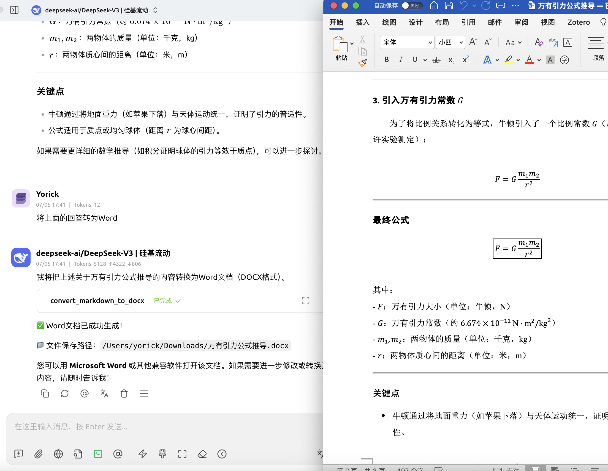

# md2doc - Markdown to DOCX MCP Server

A Model Context Protocol (MCP) server that converts Markdown text to DOCX format using an external conversion service.



## Features

- Convert Markdown text to DOCX format
- Support for custom templates
- Multi-language support (English, Chinese, etc.)
- Automatic file download to user's Downloads directory
- Template listing and management

## Installation

### Prerequisites

1. Install [uv](https://github.com/astral-sh/uv) (recommended):
   ```bash
   curl -LsSf https://astral.sh/uv/install.sh | sh
   source $HOME/.local/bin/env
   ```

   Or install via Homebrew (Only Mac):
   ```bash
   brew install uv
   ```

### Install Dependencies

1. Clone this repository
2. Install dependencies using uv (recommended):
   ```bash
   uv pip install -e .
   ```

   Or using traditional pip:
   ```bash
   pip install -e .
   ```

## Environment Variables

### Setting Environment Variables

#### macOS/Linux
```bash
# Temporary (current session only)
export DEEP_SHARE_API_KEY="your-api-key-here"

# Permanent - add to ~/.zshrc or ~/.bashrc
echo 'export DEEP_SHARE_API_KEY="your-api-key-here"' >> ~/.zshrc
source ~/.zshrc
```

#### Windows (Command Prompt)
```cmd
# Temporary (current session only)
set DEEP_SHARE_API_KEY=your-api-key-here

# Permanent
setx DEEP_SHARE_API_KEY "your-api-key-here"
```

#### Windows (PowerShell)
```powershell
# Temporary (current session only)
$env:DEEP_SHARE_API_KEY="your-api-key-here"

# Permanent
[Environment]::SetEnvironmentVariable("DEEP_SHARE_API_KEY", "your-api-key-here", "User")
```

### API Key

#### Free Trial API Key
Use this key for testing:
```
f4e8fe6f-e39e-486f-b7e7-e037d2ec216f
```

#### Purchase API Key - Super Low Price!

- [Purchase Link](https://www.deepshare.app/purchase-en.html)
- [中国大陆购买](https://www.deepshare.app/purchase.html)

## Usage

### As an MCP Server

Add this to your MCP client configuration:

```json
{
  "mcpServers": {
    "md2doc": {
      "command": "uv",
      "args": [
        "--directory",
        "/PATH/TO/md2docx-mcp",
        "run",
        "python",
        "-m",
        "md2doc.server"
      ],
      "env": {
        "DEEP_SHARE_API_KEY": "your-api-key-here"
      }
    }
  }
}
```

### Available Tools

- `convert_markdown_to_docx`: Convert markdown text to DOCX
- `list_templates`: Get available templates by language

## License

MIT 